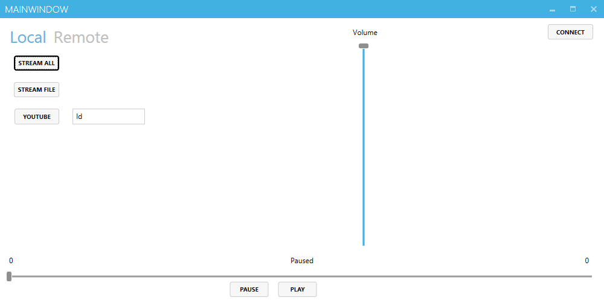

# MPC-Streamer
Streams audio data such as all current audio output or a specific file to MPD

Future plans include expanding the application to be a proper MPD client.

Currently the application streams audio to a server using NAudio to which MPD connects for playback.

Uses:
* C# and WPF
* Naudio
* Sharp MPC library
